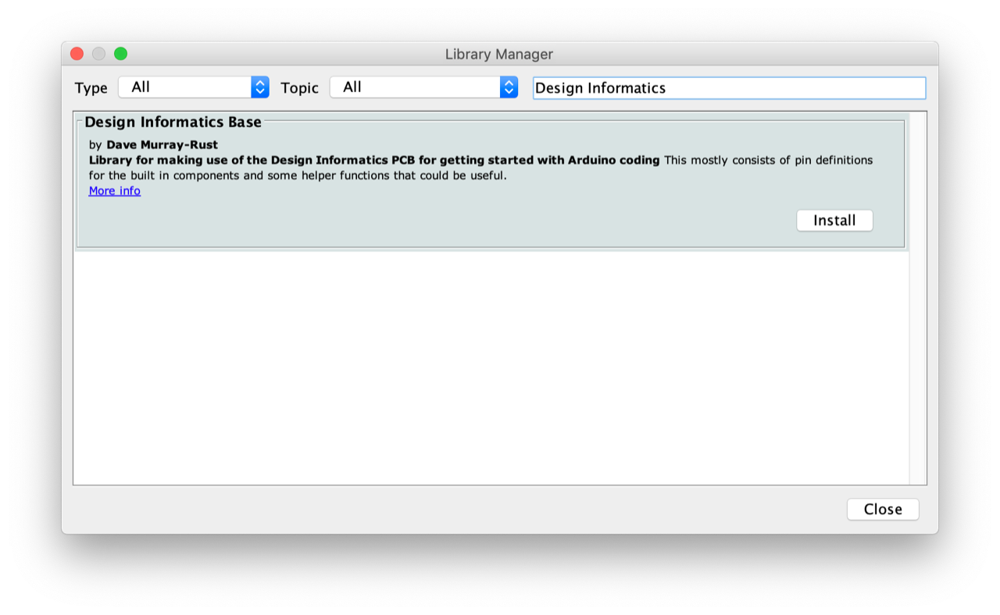

# Design-Informatics-Kit

Documentation and Code Examples for Design Informatics Home Kit

## Contents

<!-- TOC depthFrom:1 depthTo:6 withLinks:1 updateOnSave:1 orderedList:0 -->

- [Design-Informatics-Kit](#design-informatics-kit)
	- [Contents](#contents)
	- [What is in the kit?](#what-is-in-the-kit)
		- [Checklist](#checklist)
	- [Setup](#setup)
	- [Additional notes](#additional-notes)
		- [Sensors](#sensors)
			- [On-Board IMU (Accelerometer / gyroscope)](#on-board-imu-accelerometer-gyroscope)
			- [Temperature Sensor](#temperature-sensor)
		- [APIs](#apis)
	- [Extras](#extras)
		- [Nano Pinout](#nano-pinout)
	- [Further Resources](#further-resources)
		- [LinkedIn Learning Courses](#linkedin-learning-courses)

<!-- /TOC -->

## What is in the kit?

### Checklist

- [ ] Arduino Nano 33 IoT [[Docs]](https://www.arduino.cc/en/Guide/NANO33IoT)
- [ ] Breadboard
- [ ] Jumper Wires
- [ ] Crocodile Clips
- [ ] micro-USB Cable
- [ ] Temperature Sensor [[Docs]](https://wiki.seeedstudio.com/Grove-TemperatureAndHumidity_Sensor/)
- [ ] Adafruit 1.44" Colour TFT [[Docs]](https://learn.adafruit.com/adafruit-1-44-color-tft-with-micro-sd-socket)
- [ ] NeoPixel Ring [[Docs]](https://learn.adafruit.com/adafruit-neopixel-uberguide/the-magic-of-neopixels)

## Setup

See the [Getting Started guide](./getting-started.md) for instructions on setting up to use your kit.

***

## Additional notes

Notes on usage and helpful techniques

***

### Libraries

To use either the onboard IMU, DI Board or other sensor, you will first need to install the relevant library. See below for which libraries to install

#### On-Board IMU (Accelerometer / gyroscope)

The Inertial measurement unit (IMU) consists of a combined accelerometer and gyroscope. To use the IMU you will need to download the `Arduino_LSM6DS3` library via the Arduino Library Manager.

#### Design Informatics Board

Interfacing with the [Design Informatics Board](https://github.com/Edinburgh-College-of-Art/DesignInformaticsPCB) requires the `Design Informatics Base` Library

#### Temperature Sensor

The included Temperature Sensor is Grove DHT11. Se the Grove [Documentation](https://wiki.seeedstudio.com/Grove-TemperatureAndHumidity_Sensor/) for a full breakdown. The DHT11 is a common sensor, so any library will be fine. We recommend using the `DHT Sensor Library` by Adafruit available via the Library Manager

### APIs

An API is what allows you to interact with someone else's application. [See the Public list APIs](https://public-apis.io) for some inspiration.

***

## Extras

Some extra tidbits to make life easier

### Nano Pinout

Pins on the nano are labelled in such small typeface it can be difficult to read. [This .pdf](./extras/Nano_33_IoT_Pinout_cheatsheet.pdf) can be printed out, placed over your breadboard and the Arduino can plugged in on top. Get creative and try making your own.

## Further Resources

### LinkedIn Learning Courses

- [Learning Arduino: Foundations](https://www.linkedin.com/learning/learning-arduino-foundations-2/getting-started-with-arduino?u=50251009&auth=true)
- [Learning Arduino: Interfacing with Hardware](https://www.linkedin.com/learning/learning-arduino-interfacing-with-hardware/open-up-your-digital-world-with-arduino?u=50251009&auth=true)
- [C++ Essentials](https://www.linkedin.com/learning/c-plus-plus-essential-training-2/about-this-course?u=50251009&auth=true)
